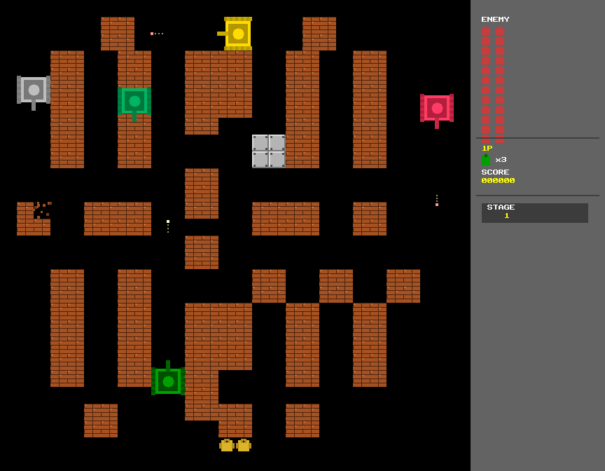

# TankStrike

A modern Battle City remake built entirely in Go with the [Glow](https://github.com/AchrafSoltani/glow) engine — a pure Go 2D software renderer that communicates directly with X11. No CGo, no images, no external assets. Everything is drawn with primitives and generated procedurally.



## Features

- **10 hand-crafted levels** with increasing difficulty
- **4 enemy types** — Basic (grey), Fast (yellow), Power (pink), Armour (green) — each with distinct behaviour and stats
- **6 power-ups** — Star, Extra Life, Helmet, Shovel, Bomb, Clock
- **Procedural audio** — all sound effects generated from sine waves and noise (no audio files)
- **Pixel-art rendering** — tanks, tiles, particles, and UI drawn entirely with `DrawRect`, `FillCircle`, and `SetPixel`
- **8x8 bitmap font** — full printable ASCII set, scaleable
- **Particle system** — explosions, sparks, and debris with a pre-allocated pool
- **Screen shake** — on explosions and impacts
- **Save/load** — high score and level progress persisted to `~/.config/tankstrike/save.json`
- **HUD sidebar** — enemy count, lives, score, and stage indicator

## Controls

| Key | Action |
|-----|--------|
| W / Up | Move up |
| S / Down | Move down |
| A / Left | Move left |
| D / Right | Move right |
| Space | Fire |
| Escape | Pause |
| Enter | Select / Continue |
| N | Skip to next level (debug) |

## Building from Source

### Prerequisites

- Go 1.21+
- `libasound2-dev` (ALSA headers for audio)
- X11 (or XWayland)

```bash
# Install build dependencies (Debian/Ubuntu)
sudo apt install libasound2-dev

# Clone both repositories
git clone https://github.com/AchrafSoltani/glow.git
git clone https://github.com/AchrafSoltani/TankStrike.git

# Build and run
cd TankStrike
go run main.go
```

> The `go.mod` expects `glow` to be cloned alongside `TankStrike` (i.e. `../glow`).

### Build a standalone binary

```bash
go build -o TankStrike main.go
./TankStrike
```

## Installing the .deb Package

### Build the package

```bash
chmod +x build-deb.sh
./build-deb.sh
```

This produces `tankstrike_1.0.0_amd64.deb` in the project root.

### Install

```bash
sudo dpkg -i tankstrike_1.0.0_amd64.deb
sudo apt -f install  # resolve dependencies if needed
```

### Run

```bash
tankstrike
```

Or launch from your application menu.

## Project Structure

```
TankStrike/
├── main.go              # Entry point, game loop
├── config/              # Shared constants (grid, window, gameplay)
├── game/                # Game orchestrator, state machine
├── world/               # Tile types, 26x26 grid, level data
├── entity/              # Tank, bullet, enemy, power-up, eagle
├── system/              # Input, physics, AI, spawning, combat
├── render/              # All drawing: tanks, tiles, particles, HUD, menus, font
├── audio/               # Procedural sound synthesis (oto/v2)
└── save/                # JSON save/load
```

## Enemy Types

| Type | Colour | Speed | HP | Behaviour |
|------|--------|-------|----|-----------|
| Basic | Grey | Slow | 1 | Random wandering |
| Fast | Yellow | Fast | 1 | Quick direction changes |
| Power | Pink | Medium | 1 | Aggressive, fast bullets |
| Armour | Green | Slow | 4 | Tanky, persistent |

## Engine

Built with [Glow](https://github.com/AchrafSoltani/glow) — a pure Go 2D graphics library that talks directly to X11 via Unix sockets. No CGo, no SDL, no OpenGL. Just Go and the X11 protocol.

## Licence

MIT
